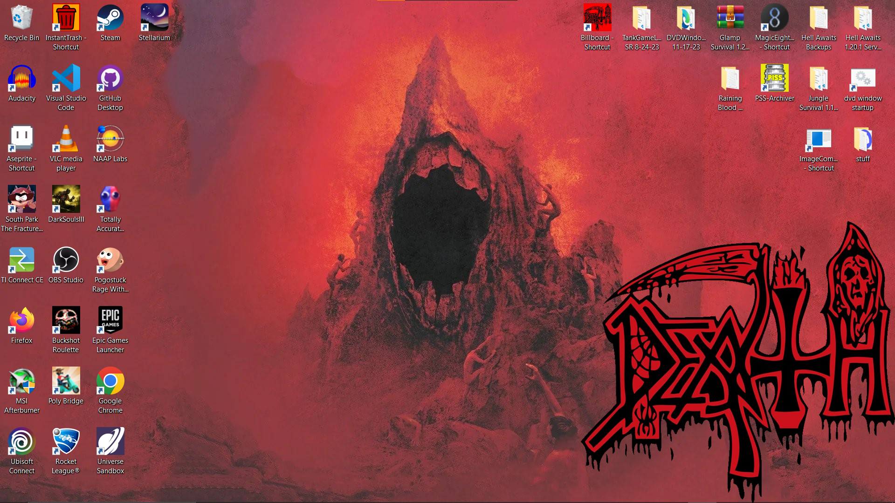

# Billboard Panel
# BY: StephenKing638 (aka BoneDaddy638)
# BUILD: v1.0 11-18-24

Displays the provided `image.png` on the window in the bottom right of the screen, the max dimension is defined within this properties file `maxdim.txt`. To run, just open the `Billboard.exe` - easy!

**I DO NOT OWN THE PROVIDED DEMO IMAGE FOR THIS APP, ALL CREDIT GOES TO THE GREATEST METAL BAND ON EARTH: DEATH**

# 

# App No Work!

If the application does not open and displays a message like "requires a Java Runtime Environment," you can follow these troubleshooting steps:
1. Verify the Java Installation:
    - Ensure that Java is installed on your system
    - This app is built on **JDK v17** so any older version of the Java Development Kit will not work.
2. Check the `%JAVA_HOME%` Environment Variable (Windows only):
    - If the application isn't working afer step 1, the java home variable probably is not set, so you will need to fix [using this guide](https://confluence.atlassian.com/doc/setting-the-java_home-variable-in-windows-8895.html)
3. If opening the app produces a `CRASH-date.log` file, check if it has to do with the image being read, if so, make sure the `image.png` exists in the same directory as the executable and that it can actually be read.

## Keybinds
* `ESC` - Close window
* `CTRL + F1` - Toggle moving the logo with the mouse
* `CTRL + F2` - Toggle window acting like the DVD logo screen and bouncing off the corners of the screen

## Settable Properties
Properties are located in `maxdim.txt`. If the file is missing launch the app then you can modify the properties then rerun the app. If any properties are invalid, the file is rewritten to the default properties.

1. First line is a number of how large you want the logo to be, cannot be negative.
    - default is: 540 
2. The second property is the alignment, default value is `BOTTOM_RIGHT`.
    - `TOP_LEFT`
    - `TOP_RIGHT`
    - `BOTTOM_LEFT`
    - `BOTTOM_RIGHT`

## Other notes
If you ain't trustin' me bro or if you curious, the soruce code to this project is included within the `billboardpanel` directory, the only compiled class file is `billboardpanel\src\main\java\sr\billboardpanel\BillboardPanel.java` (and of course it's nested classes).